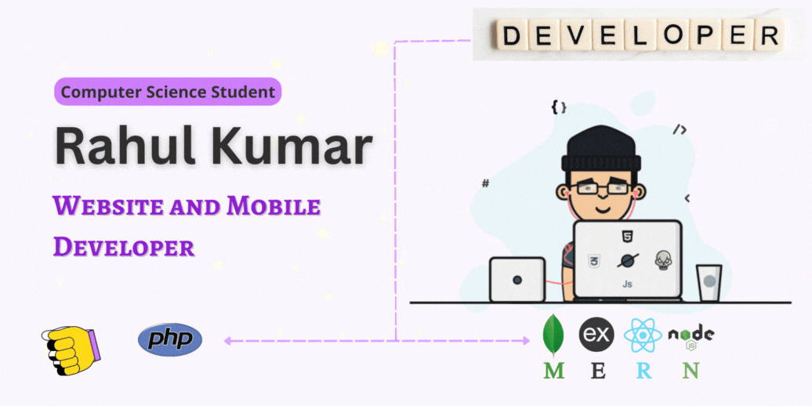
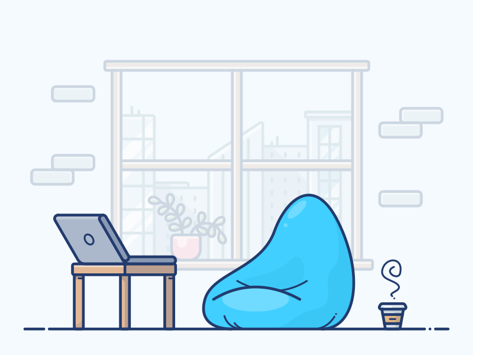

## Hi, I'm Rahul kumar 👋 [here](https://rkpassin132.github.io/)

I'm a developer who is passionate about designing & developing web and mobile applications. I even have worked on different projects and platforms like mobile app and website development but I actually like the database design and backend development. Enthusiastic engineering graduate with good knowledge in C++, HTML/CSS, JavaScript, PHP, SQL languages. Eager to work on challenging projects. 

 

## Find me around the web

- Coding status on [HakerRank](https://www.hackerrank.com/rkpassin132) 🧑‍💻
- Catch me on [AngleCo](https://angel.co/u/rahul-kumar-1943) 🙂
- Check profile on [LinkedIn](https://www.linkedin.com/in/rahul-kumar-392a17196/) 💼

 
 

## Languages

 
 

## Frameworks

 

## Tools

 
 